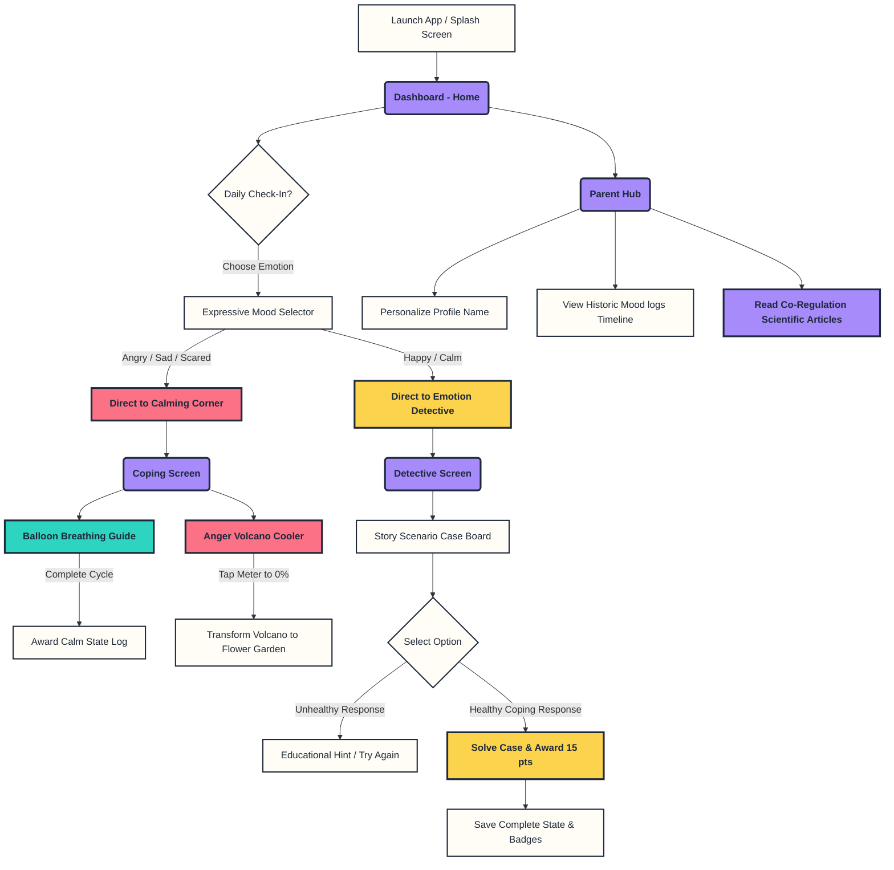

# MoodBuddy 🧸 — Emotional Intelligence App for Kids

MoodBuddy is a production-grade, Go-To-Market (GTM) ready cross-platform application designed to educate children (ages 4-10) about emotional intelligence and equip them with healthy, science-backed coping mechanisms for big feelings like anger. 

Developed with a single, highly optimized codebase using **Expo (React Native) + Expo Router + TypeScript**, MoodBuddy compiles natively on **iOS and Android** and serves pre-rendered static routes on **Web** for high-performance SEO discoverability.

---

## 🎨 Premium Visual Aesthetics (No Gradients)

MoodBuddy utilizes a custom **Modern Playful Flat / Neo-Brutalist** design system designed to engage children while retaining a premium, GTM-ready appearance. To adhere strictly to your branding rules, **no gradients are used**.

### Color Palette (Theme Tokens)
- 🌌 **Warm Sand Background** (`#FAF8F5`): A gentle cream canvas that reduces blue light strain.
- 🎨 **Deep Ink Accents** (`#1E293B`): Thick 3px borders, dark bold text, and solid drop shadows.
- 🦄 **Soft Lavender** (`#A78BFA`): Primary brand color for buttons and controls.
- 😡 **Fiery Coral Red** (`#FB7185`): Emotion token representing anger.
- 😌 **Mint Teal** (`#2DD4BF`): Calming token representing peace and deep breathing.
- 😊 **Butter Yellow** (`#FCD34D`): Energetic token representing happiness.
- 😢 **Sky Blue** (`#60A5FA`): Cool token representing sadness.

### Core Visual Elements
- **Tactile Depth**: 3px solid borders paired with offset flat shadows (e.g., `4px 4px` translation) that physically compress when pressed to simulate real-world interactive toy buttons.
- **Child-Friendly Typo**: Generous border roundings (`16px` to `24px`) and friendly, legible sans-serif typography.

---

## 🚀 Key Features

### 1. Daily Mood Check-In (`Home`)
- **Interactive Carousel**: Renders 5 expressive emotion characters (Happy, Angry, Sad, Scared, Calm).
- **Personalized Affirmations**: Dynamically greets the child by name and displays coping affirmations based on their selected mood.
- **Summary Boards**: Showcases current points score and completed detective cases to encourage engagement.

### 2. The Calming Corner (`Coping`)
- **Balloon Breathing**: A visual deep breathing coach (4s Inhale, 4s Hold, 4s Exhale) that expands and contracts a flat balloon using the React Native `Animated` API.
- **Anger Volcano**: A safe venting exercise where kids tap the screen to release steam. Tapping shakes the volcano and decreases the "Anger Meter" from 100% (erupting red) to 0% (cooling down to a green mountain covered in flowers).

### 3. Emotion Detective Mini-Game (`Detective`)
- **6 Scenario Cases**: Challenges kids to solve real-world playground and home problems (e.g., Liam's knocked-down tower, Chloe's fear of storms, Zoe's sharing struggle).
- **Gamified Outcomes**: Offers multiple-choice buttons. Selecting the healthy co-regulation coping option awards ★15 points, while unhealthy choices provide neutral, educational feedback and allow them to try again.
- **Async Storage Persistence**: Progress is locally stored and loaded seamlessly.

### 4. Parent & Teacher Hub (`Parent`)
- **Personalization Editor**: Enables parents to input and save the child's name.
- **Mood History Timeline**: Displays a historical log tracking the child's check-ins, allowing parents to monitor emotional patterns.
- **Co-Regulation Tips**: High-fidelity article cards educating parents on co-regulation, emotional naming ("name it to tame it"), and energy redirection.
- **Danger Zone**: A secure button to wipe cache memory and restart the learning path.

---

## 🗺️ User Flow & Architecture Diagram

The flow of a child interacting with MoodBuddy is mapped out in the diagram below:



---

## 📂 Project Structure

```text
src/
├── app/                        # Expo Router Navigation Routes
│   ├── (tabs)/                 # Bottom Tab Bar Navigation Setup
│   │   ├── _layout.tsx         # Custom Native Tabs layout config
│   │   ├── index.tsx           # Home Dashboard & Mood Selection screen
│   │   ├── coping.tsx          # Calming Corner (Breathing / Volcano tabs)
│   │   ├── detective.tsx       # Emotion Detective mini-game screen
│   │   └── parent.tsx          # Parent / Teacher Hub & settings
│   └── _layout.tsx             # Root Entrance config with AppProvider
├── components/                 # Reusable UI Custom Components
│   ├── Card.tsx                # Neo-Brutalist card wrapper with active press scaling
│   ├── Button.tsx              # Tactile translation-press button
│   ├── MoodSelector.tsx        # Daily mood slider character selection
│   ├── BreathingExercise.tsx   # React Native Animated visual breathing balloon
│   ├── VolcanoCooler.tsx       # Tapping volcano release game with shaking physics
│   └── ScenarioGame.tsx        # Detective multiple-choice stories and scoring board
├── constants/                  # Configuration & Constant Tokens
│   ├── Colors.ts               # Palette layout tokens and emotion configurations
│   └── Scenarios.ts            # Detailed database array of game scenarios
├── context/                    # React Context stores
│   └── AppContext.tsx          # Global child profile, scores, check-in history logs
└── declarations.d.ts           # Typescript declaration for Web CSS imports
```

---

## 🛠️ Getting Started & Local Development

### 1. Prerequisites
Ensure you have [Node.js](https://nodejs.org/) installed (v18 or v20 recommended).

### 2. Installation
Navigate to the root directory and install dependencies:
```bash
npm install
```

### 3. Run Locally
Execute the developer environment for your target build:

- **Web Browser (Recommended)**:
  ```bash
  npm run web
  ```
- **Android Simulator / Device**:
  ```bash
  npm run android
  ```
- **iOS Simulator / Device** (Requires macOS / Xcode):
  ```bash
  npm run ios
  ```

### 4. Build Production Bundle
To compile and build static distribution directories:
```bash
npx expo export --platform web
```
This outputs a fully optimized standalone compilation bundle under `dist/` ready to upload to hosting services like Netlify, Vercel, or AWS S3.

---

## 📦 How to Create GitHub Repo & Push Code

Follow these commands to initialize a git repository locally, commit the changes, and deploy them to your GitHub account:

### 1. Initialize Local Git
Ensure you are in the project folder and run:
```bash
git init
```

### 2. Stage and Commit All Files
Staging creates a snapshot. Commit the files to record it:
```bash
git add .
git commit -m "feat: initial commit of GTM-ready MoodBuddy app"
```

### 3. Create a Remote Repository on GitHub
1. Log in to your account at [GitHub](https://github.com/).
2. Click the **New** button to create a new repository.
3. Name it (e.g. `moodbuddy`) and keep it Public or Private. Do not check "Add a README", "Add .gitignore", or "Choose a license" (as they are already configured in this project).
4. Click **Create repository**.

### 4. Link & Push Your Local Repo
Copy the Git URL from your new GitHub repository page, and run the following command in your terminal (replacing `YOUR_GITHUB_USERNAME` and `YOUR_REPO_NAME`):
```bash
# Rename the default branch to main
git branch -M main

# Link local repository to remote GitHub repository
git remote add origin https://github.com/YOUR_GITHUB_USERNAME/YOUR_REPO_NAME.git

# Push code to GitHub
git push -u origin main
```
Once executed, all code and generated graphics assets will be uploaded and accessible online!
